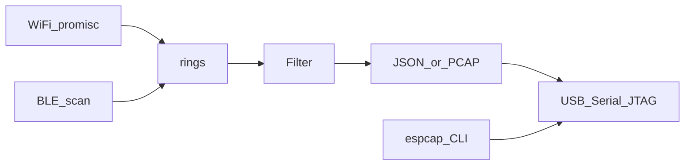

# Architecture

See the implementation plan in [plan/architecture.md](plan/architecture.md) for radio/core mapping.

Shared types live in `crates/protocol`. The host CLI is `crates/host`. Firmware is a separate crate in `firmware/` built twice (`xtensa-esp32s3-espidf`, `riscv32imac-esp-espidf`).
