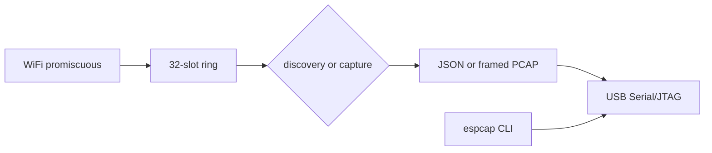

# Architecture

Host CLI and firmware share `crates/protocol`. Firmware is `firmware/`, built twice (`xtensa-esp32s3-espidf`, `riscv32imac-esp-espidf`). The CLI is `crates/host`.

WiFi RX copies into the ring and returns. A later task parses, filters, dedups discovery, and writes the serial port. Config (including `running`) is stored in NVS under namespace `espcap`.

The BLE encode path is in the same task. NimBLE extended discovery enqueues advertisements on that path. See [BLE](features/ble.md).

Chip limits and the original core map are in [plan/architecture.md](plan/architecture.md).
