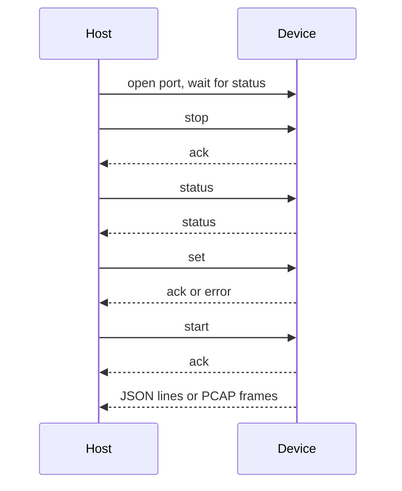

# Serial protocol

Newline JSON commands and events at 115200 8N1 on USB Serial/JTAG. PCAP uses a separate framed binary stream after `start`.

## Overview

Commands and JSON events are one object per line (`\n`; CRLF is accepted). That matches [serial-capture](https://github.com/brianlechthaler/serial_capture) `--json --json-nested`.

The device answers `set`, `start`, and `stop` with `{"event":"ack"}` or `{"event":"error","msg":"..."}`. `status` and the unsolicited boot line use `event` `status`.

Omitted `set` fields keep the previous value. `dwell_ms` must be 100–2000. `wifi_types` must be non-empty. `hopmask` bits above channel 14 are rejected. 5 GHz channel numbers must be 32–177. ESP32-S3 rejects `wifi_band` `5` or `both`, and any non-empty `channels_5ghz`.

After a successful `start` in PCAP format, device TX is framed records only. `stop` is still parsed on RX.

## Commands

```json
{"cmd":"status"}
{"cmd":"start"}
{"cmd":"stop"}
{"cmd":"get"}
{"cmd":"set","radio":"wifi","mode":"discovery","format":"json","wifi_band":"2.4","dwell_ms":300,"hopmask":"0x0421","wifi_types":["mgmt","data"],"filters":{"oui":["F4:4E:FC"],"ssid_regex":"^lab"}}
```

`get` parses and is not used by the CLI.

`hopmask` is a string (`"0x0421"`) on the wire and a `u16` inside the device.

### Status

```json
{"event":"status","chip":"esp32s3","wifi_bands":["2.4"],"radio":"off","mode":"discovery","format":"json","wifi_band":"2.4","dwell_ms":300,"hopmask":"0x0421","channels_5ghz":[],"ble_interval_ms":100,"ble_window_ms":30,"ble_active":false,"wifi_types":["mgmt","data"],"running":false,"drops":{"ring_overflow":0,"cdc_backpressure":0,"truncated":0}}
```

`chip` is `esp32s3` or `esp32c5`. `wifi_bands` is `["2.4"]` or `["2.4","5"]`.

### Discovery events

`wifi_ap`, `wifi_sta`, and `ble`. Fields: `mac`, `oui`, `rssi`, `channel`, `freq_mhz`, `ts_ms`, `hit_count`, `first_ts_ms`, `last_ts_ms`. `wifi_ap` always has `ssid` (empty string if missing). `wifi_sta` and `ble` omit `ssid` or `name` when absent. `ble` adds `addr_type` (`public` or `random`) and optional `company_id`.

### Capture events

`wifi_frame` and `ble_adv` add `payload_hex`. No hit counters.

## PCAP frames

```
0xA5 0x5A | type u8 | length u16 big-endian | payload
```

| Type | Payload |
|------|---------|
| 0 | Classic PCAP global header (magic `0xA1B2C3D4`, version 2.4, snaplen 2500) |
| 1 | 16-byte PCAP record, 23-byte radiotap, 802.11 MPDU. File DLT 127 |
| 2 | 16-byte PCAP record, 10-byte BTLE RF header, reconstructed ADV PDU. File DLT 256 |

The ring copy is capped at 768 bytes even though the global header snaplen is 2500. Radiotap present flags are TSFT, Flags, Rate, Channel, and dBm antenna signal. Flags mark FCS present.

JSON mode stays newline JSON for the whole session. PCAP mode does not interleave JSON after `start`.

## Diagram



## Related

- [CLI](cli.md)
- [WiFi](wifi.md)
- [BLE](ble.md)
