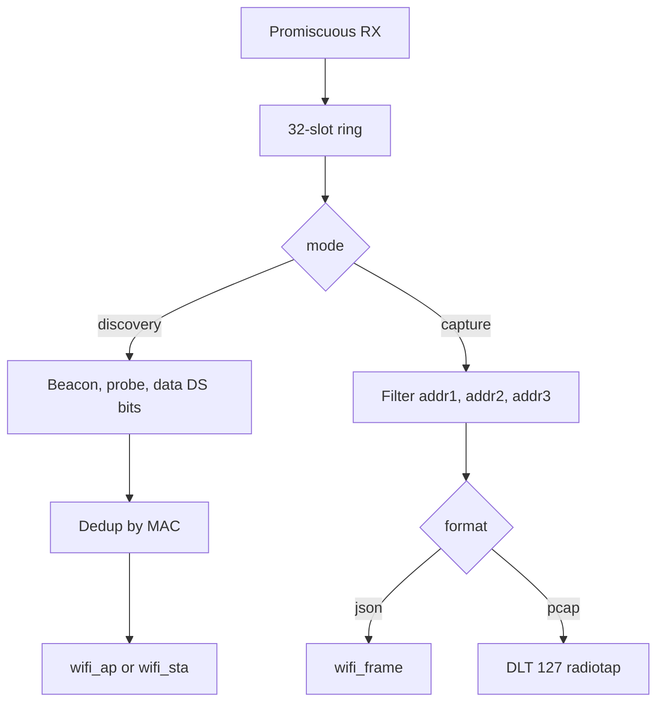

# WiFi capture

Promiscuous 802.11 receive. Discovery emits deduplicated `wifi_ap` and `wifi_sta` JSON. Capture emits every matching frame as `wifi_frame` JSON or radiotap PCAP (DLT 127).

## Overview

ESP32-S3 is 2.4 GHz only. ESP32-C5 hops 2.4 GHz, 5 GHz, or both. The radio stays unassociated and changes channel on a dwell timer while capture is running.

Default hop is channels 1, 6, and 11 (`hopmask` `0x0421`) at 300 ms dwell. Accepted dwell is 100–2000 ms. The hop task sleeps at least 200 ms. Default frame types are management and data. Control frames stay off until `wifi_types` includes `ctrl`.

The promiscuous callback copies into a 32-slot ring, 768 bytes per frame. A full ring increments `drops.ring_overflow` on `status`.

Discovery writes JSON only. `--format pcap` with `--mode discovery` produces no WiFi lines. Capture with `--format pcap` sends framed radiotap records. Capture with `--format json` sends `wifi_frame` (`payload_hex` is the MPDU).

### What discovery records

| Frame | Recorded address |
|-------|------------------|
| Beacon | AP (BSSID) |
| Probe response | AP (BSSID), plus unicast addr1 when it differs from the BSSID |
| Probe request | Station (addr2) |
| Data, From DS | Unicast addr1 (receiver) |
| Data, To DS | Unicast addr2 (transmitter) |
| Data, neither DS bit | Unicast addr1 and addr2 |
| Data, both DS bits (WDS) | nothing |
| Group address (multicast or broadcast) | not recorded as a station |

SSID is taken from the SSID information element on beacons and probes. Data frames have no SSID, so an `ssid_regex` filter drops those stations.

Dedup is per MAC. The first sighting is sent. Later sightings wait 5 seconds unless RSSI changes by 6 dB or more. `hit_count` still increases on suppressed repeats. The same MAC seen as an AP and as a station shares one dedup entry.

Capture is not deduped. A frame is kept when addr1, addr2, or addr3 matches the filter.

## Usage

```bash
espcap --port /dev/ttyACM0 set --radio wifi --mode discovery --format json
espcap --port /dev/ttyACM0 start --json capture.jsonl
```

5 GHz on ESP32-C5. Omitting `--channels-5ghz` hops 36, 40, 44, and 48:

```bash
espcap --port /dev/ttyACM1 set --radio wifi --mode discovery --format json --wifi-band both
```

Every frame, including control:

```bash
espcap --port /dev/ttyACM0 set --radio wifi --mode capture --format pcap --wifi-types mgmt,ctrl,data
espcap --port /dev/ttyACM0 start --pcap capture
```

A `wifi_sta` line looks like:

```json
{"event":"wifi_sta","mac":"aa:bb:cc:dd:ee:ff","oui":"AA:BB:CC","rssi":-50,"channel":6,"freq_mhz":2437,"ts_ms":11000,"ssid":"lab","hit_count":1,"first_ts_ms":11000,"last_ts_ms":11000}
```

`ssid` is omitted when the frame had none.

## Configuration

| Option | Default | Description |
|--------|---------|-------------|
| `wifi_band` | `2.4` | `2.4`, `5`, or `both`. S3 accepts `2.4` only. |
| `dwell_ms` | `300` | Hop dwell, 100–2000. Hop sleep is at least 200 ms. |
| `hopmask` | `0x0421` | 2.4 GHz channels 1–14. Bit `(ch-1)` selects channel `ch`. Bits above channel 14 are rejected. |
| `channels_5ghz` | empty | IEEE channel numbers 32–177. C5 only. Empty plus a 5 GHz band uses 36, 40, 44, 48. |
| `wifi_types` | `mgmt`, `data` | Promiscuous filter. An empty list is rejected. |

`wifi_band` `both` alternates one 2.4 GHz channel and one 5 GHz channel per dwell. `5` hops only the 5 GHz list. `2.4` uses `hopmask` only.

2.4 GHz center frequency is `2407 + 5 * channel` (channel 14 is 2484). 5 GHz is `5000 + 5 * channel`.

## Diagram



## Troubleshooting

| Symptom | Cause |
|---------|--------|
| No `wifi_ap` or `wifi_sta` lines | Mode is capture, format is pcap, radio is `off`, or `running` is false. |
| S3 returns an `error` event on `set` | `--wifi-band 5`, `--wifi-band both`, or `--channels-5ghz`. The host CLI rejects those before sending. |
| Stations missing with an SSID filter | Data frames have no SSID, so `ssid_regex` rejects them. |
| `drops.ring_overflow` climbs | The host is slower than the ring (32 frames, 768 bytes each). |

## Related

- [CLI](cli.md)
- [Protocol](protocol.md)
- [BLE](ble.md)
