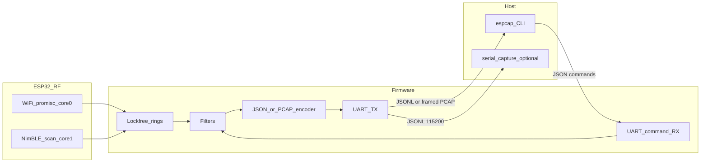

# Architecture

ESP32 firmware captures WiFi (promiscuous) and BLE advertisements on separate cores, filters in software, and emits JSON lines or framed PCAP over UART. A host CLI sends JSON commands and, in PCAP mode, owns the serial port to write `.pcap` files.



## Radio and cores

Original ESP32 has one 2.4 GHz radio. WiFi promiscuous and BLE scan can be enabled together, but RF access is time-division multiplexed (`CONFIG_ESP_COEX_SW_COEXIST_ENABLE`).

- Core 0: WiFi driver, promiscuous RX callback (copy-only), channel-hop task.
- Core 1: NimBLE host, UART RX command parser, UART TX encoder, discovery dedup.
- `BOTH` is allowed: lock WiFi to one channel (or slow hop) and set BLE scan interval equal to window. Do not promise full-rate hop plus dense BLE ads at once.

## Callback rule

The promiscuous callback runs in the Wi-Fi driver task. It must not format, print, or allocate. Copy `rssi`, `channel`, `sig_len` (cap about 2500 bytes), and payload into a drop-on-full ring. Same rule as oui-spy PCAP/Flock-You.

## Intended crate layout

```
espcap/
  Cargo.toml                 # workspace
  Makefile                   # test / lint / fmt / coverage / firmware-build
  crates/protocol/           # shared commands, filters, PCAP/radiotap (host rustc)
  crates/host/               # bin: espcap
  firmware/                  # xtensa-esp32-espidf
    rust-toolchain.toml      # channel = "esp"
    .cargo/config.toml
    sdkconfig.defaults
    src/
  docs/plan/                 # this plan
  docs/                      # user docs after features ship
  .github/workflows/
```

The protocol crate is the TDD core. Command parsing, filters, radiotap, PCAP records, and JSON event shapes are unit-tested on the host with 100% coverage on generated and changed code. Firmware FFI-copies packets into those types.

## Why esp-idf-svc, not embassy

- Same C APIs as production sniffers (`esp_wifi_set_promiscuous_*`, `wifi_promiscuous_pkt_t`).
- Dual-core pinning via `ThreadSpawnConfiguration` + `std::thread`.
- NimBLE via `esp32-nimble` (or IDF NimBLE) and tested coexistence.
- UART PCAP/JSON is ordinary std I/O.

`esp-radio` sniffer APIs are still unstable. Revisit `esp-hal` if the project later retargets ESP32-S3 with PSRAM and USB-CDC.

## ESP8266

Skip as a firmware target. Keep WiFi discovery JSON fields free of ESP32-only names so a later non-Rust ESP8266 scanner could speak the same protocol.
