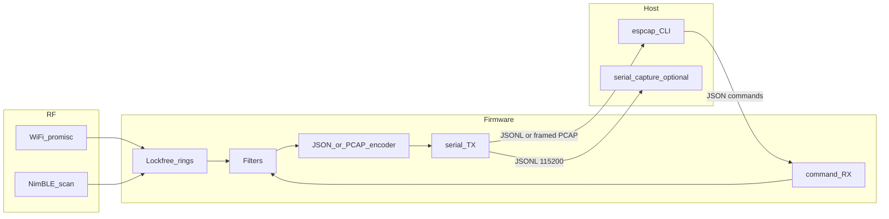

# Architecture

ESP32-S3 or ESP32-C5 firmware captures WiFi (promiscuous) and BLE advertisements, filters in software, and emits JSON lines or framed PCAP over USB serial (CDC / USB Serial-JTAG). A host CLI sends JSON commands and, in PCAP mode, owns the serial port to write `.pcap` files.



## Two chips, one protocol

One firmware crate, built twice. Shared command/event/PCAP types live in `crates/protocol`. Chip differences are compile-time (`MCU` / rustc target) plus a small runtime `status.chip` / `status.wifi_bands` so the CLI can refuse illegal `set` values.

| | ESP32-S3 | ESP32-C5 |
|---|----------|----------|
| CPU | Dual-core Xtensa LX7 | Single HP RISC-V (240 MHz) + LP core (not used for sniff) |
| Rust target | `xtensa-esp32s3-espidf` | `riscv32imac-esp-espidf` |
| WiFi | 2.4 GHz 802.11b/g/n | Dual-band Wi-Fi 6 (2.4 + 5 GHz) |
| BLE | Bluetooth 5 (LE) | Bluetooth 5 (LE) |
| Serial | USB Serial/JTAG or USB-OTG CDC; UART0 fallback | USB Serial/JTAG |
| SRAM | On-chip + optional PSRAM | 384 KB HP SRAM + optional PSRAM |

## Radio and cores

Both chips have one WiFi radio plus BLE. WiFi promiscuous and BLE scan can be enabled together; RF access is time-division multiplexed (`CONFIG_ESP_COEX_SW_COEXIST_ENABLE`). `BOTH` is allowed: lock WiFi to one channel (or slow hop) and set BLE scan interval equal to window. Do not promise full-rate hop plus dense BLE ads at once.

**ESP32-S3** (dual-core offload):

- Core 0: WiFi driver, promiscuous RX callback (copy-only), channel-hop task.
- Core 1: NimBLE host, serial RX command parser, serial TX encoder, discovery dedup.

**ESP32-C5** (single application core):

- All of the above run on the HP RISC-V core. Do not pin tasks to a second core. Keep callbacks copy-only so the WiFi driver task cannot stall behind JSON/PCAP encode.

## Callback rule

The promiscuous callback runs in the Wi-Fi driver task. It must not format, print, or allocate. Copy `rssi`, `channel`, `sig_len` (cap about 2500 bytes), and payload into a drop-on-full ring. Same rule as oui-spy PCAP/Flock-You.

On C5, 5 GHz `rx_ctrl.channel` / frequency must be preserved into the ring so radiotap and JSON `channel` are correct. MIMO/HE frames that the IDF sniffer only reports as a length still count as drops or a distinct `truncated` status — do not invent payload.

## Intended crate layout

```
espcap/
  Cargo.toml                 # workspace
  Makefile                   # test / lint / fmt / coverage / firmware-s3 / firmware-c5
  crates/protocol/           # shared commands, filters, PCAP/radiotap (host rustc)
  crates/host/               # bin: espcap
  firmware/                  # one crate, two rustc targets
    rust-toolchain.toml      # channel = "esp"
    .cargo/config.toml       # per-target linker/runner; no single default target
    sdkconfig.defaults
    sdkconfig.defaults.esp32s3
    sdkconfig.defaults.esp32c5
    src/
  docs/plan/                 # this plan
  docs/                      # user docs after features ship
  .github/workflows/
```

The protocol crate is the TDD core. Command parsing, filters, radiotap (2.4 and 5 GHz), PCAP records, and JSON event shapes are unit-tested on the host with 100% coverage on generated and changed code. Firmware FFI-copies packets into those types.

## Why esp-idf-svc, not embassy

- Same C APIs as production sniffers (`esp_wifi_set_promiscuous_*`, `wifi_promiscuous_pkt_t`).
- S3 dual-core pinning via `ThreadSpawnConfiguration` + `std::thread`; C5 uses the same std tasks without a core pin.
- NimBLE via `esp32-nimble` (or IDF NimBLE) and tested coexistence.
- USB-CDC / UART PCAP/JSON is ordinary std I/O.

`esp-radio` sniffer APIs are still unstable. Stay on esp-idf-svc for both chips. If C5 `esp-idf-svc` bindgen needs a newer IDF than S3, pin `ESP_IDF_VERSION` in firmware metadata to a version that supports **both** (IDF 5.5+ / 6.x in the shared toolkit). Still do not clone IDF into this repo.

## ESP8266 and original ESP32

Skip as firmware targets. No WROOM board is on hand, so do not add `xtensa-esp32-espidf` jobs, sdkconfig, or CI. Keep WiFi discovery JSON fields free of chip-only names so the same protocol works on S3 and C5.
